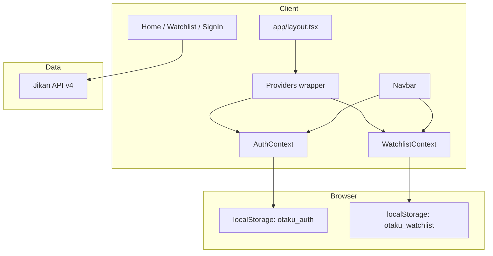

# Anime Streaming App — Foundation Plan

## Current state

The workspace at [`c:\Users\lebog\OneDrive\Desktop\anime site`](c:\Users\lebog\OneDrive\Desktop\anime site) is empty (no `package.json`, no source). Everything will be created from scratch.

## Architecture overview



## Step 1 — Project scaffold

Run `create-next-app` in the workspace root:

```bash
npx create-next-app@latest . --typescript --tailwind --eslint --app --no-src-dir --import-alias "@/*"
```

Install Lucide React:

```bash
npm install lucide-react
```

## Step 2 — Theme and global layout

**Tailwind theme** — extend [`tailwind.config.ts`](tailwind.config.ts) with Otaku palette:

| Token | Hex | Usage |
|-------|-----|-------|
| `otaku-black` | `#0B0C10` | Page background |
| `otaku-grey` | `#1F2833` | Cards, navbar, inputs |
| `otaku-violet` | `#8A2BE2` | Accents, badges, focus rings |

**Global styles** — [`app/globals.css`](app/globals.css): set `body` background to `otaku-black`, default text to light grey, custom scrollbar, focus-visible styles using violet accent.

**Root layout** — [`app/layout.tsx`](app/layout.tsx):
- Load a modern font (e.g. Inter via `next/font/google`)
- Wrap children in a client `Providers` component
- Apply `min-h-screen bg-otaku-black text-gray-100`
- Include `<Navbar />` above `{children}`

## Step 3 — Context providers (localStorage persistence)

Both contexts will be **client components** with hydration-safe localStorage reads (defer until `useEffect` to avoid SSR mismatch).

### Shared types — [`lib/types.ts`](lib/types.ts)

```typescript
export interface User {
  id: string;
  name: string;
  email: string;
  avatarUrl?: string;
}

export interface AnimeItem {
  malId: number;
  title: string;
  imageUrl: string;
  score?: number;
  episodes?: number;
  synopsis?: string;
}
```

### AuthContext — [`contexts/AuthContext.tsx`](contexts/AuthContext.tsx)

- **Storage key:** `otaku_auth`
- **State:** `user: User | null`, `isLoading: boolean`
- **On mount:** read JSON from localStorage; set `isLoading` false
- **Methods:**
  - `signIn(email, name?)` — create mock user (deterministic id from email), persist, update state
  - `signOut()` — clear storage and state
- **Export:** `AuthProvider`, `useAuth()` hook with guard if used outside provider

Mock auth: no password validation; any email signs in. Default avatar via [DiceBear](https://api.dicebear.com/) or initials fallback in UI.

### WatchlistContext — [`contexts/WatchlistContext.tsx`](contexts/WatchlistContext.tsx)

- **Storage key:** `otaku_watchlist`
- **State:** `watchlist: AnimeItem[]`, `isLoading: boolean`
- **On mount:** hydrate from localStorage
- **Methods:**
  - `addToWatchlist(anime)` — skip duplicates by `malId`
  - `removeFromWatchlist(malId)`
  - `isInWatchlist(malId)` — boolean helper
  - `watchlistCount` — derived count for navbar badge
- **Sync:** write to localStorage on every mutation

### Providers wrapper — [`components/Providers.tsx`](components/Providers.tsx)

```tsx
<AuthProvider>
  <WatchlistProvider>{children}</WatchlistProvider>
</AuthProvider>
```

## Step 4 — Navigation bar

**File:** [`components/Navbar.tsx`](components/Navbar.tsx) (client component)

Layout (responsive):
- **Desktop:** logo left | centered/max-width search | watchlist + auth right
- **Mobile:** stacked or hamburger-friendly row; search full-width below logo row

| Element | Behavior |
|---------|----------|
| **Logo** | Link to `/`, violet accent text + Lucide `Play` or custom mark |
| **Search input** | Controlled input; on submit navigates to `/?q=query` (Lucide `Search` icon inside input) |
| **Watchlist link** | Link to `/watchlist`; Lucide `Bookmark`; violet badge with `watchlistCount` (hidden when 0) |
| **Logged in** | Avatar circle (image or initials) + dropdown/button "Sign Out" calling `signOut()` |
| **Logged out** | Violet-outlined "Sign In" button linking to `/sign-in` |

Styling: sticky top, `bg-otaku-grey/95 backdrop-blur`, bottom border `border-otaku-violet/20`.

## Step 5 — Jikan API layer

**File:** [`lib/jikan.ts`](lib/jikan.ts)

- Base URL: `https://api.jikan.m4e.xyz/v4`
- Functions:
  - `searchAnime(query: string)` → `/anime?q=...&limit=24`
  - `getTopAnime()` → `/top/anime?limit=24` (default home feed)
  - `getAnimeById(malId)` → `/anime/{id}/full` (detail page)
- Map Jikan response shapes to `AnimeItem`
- Basic error handling; return empty array on failure

No API key required. Use `fetch` with `next: { revalidate: 3600 }` in server components for caching.

## Step 6 — Pages and components

### Home — [`app/page.tsx`](app/page.tsx)

- Server component reads `searchParams.q`
- If `q` present → `searchAnime(q)`; else → `getTopAnime()`
- Renders [`components/AnimeGrid.tsx`](components/AnimeGrid.tsx) with results
- Section title: "Trending" or `Results for "{q}"`

### Anime grid/card

- [`components/AnimeCard.tsx`](components/AnimeCard.tsx) — poster, title, score badge, link to `/anime/[id]`
- [`components/AnimeGrid.tsx`](components/AnimeGrid.tsx) — responsive CSS grid (`grid-cols-2 sm:3 lg:4 xl:6`)

### Anime detail — [`app/anime/[id]/page.tsx`](app/anime/[id]/page.tsx)

- Fetch anime by MAL id
- Hero: banner/poster, synopsis, metadata
- [`components/WatchlistButton.tsx`](components/WatchlistButton.tsx) — toggles add/remove via `useWatchlist()`
- Placeholder "Watch Now" button (streaming UI deferred; links to `#` or future `/watch/[id]` route)

### Watchlist — [`app/watchlist/page.tsx`](app/watchlist/page.tsx)

- Client page using `useWatchlist()`
- Empty state with Lucide `Bookmark` + CTA to browse home
- Reuses `AnimeGrid` with stored items; remove button on each card

### Sign in — [`app/sign-in/page.tsx`](app/sign-in/page.tsx)

- Client form: email (required), display name (optional)
- Submit calls `signIn()` then `router.push("/")`
- Redirect to home if already logged in
- Otaku-styled card centered on page

## Step 7 — Responsive and polish

- All pages: `max-w-7xl mx-auto px-4 sm:px-6 lg:px-8`
- Touch-friendly tap targets (min 44px on mobile nav actions)
- Loading skeletons for grid while Jikan fetches (optional `loading.tsx` in `app/`)
- `metadata` in root layout: title "OtakuStream", description

## File tree (new)

```
app/
  layout.tsx
  page.tsx
  globals.css
  sign-in/page.tsx
  watchlist/page.tsx
  anime/[id]/page.tsx
components/
  Navbar.tsx
  Providers.tsx
  AnimeCard.tsx
  AnimeGrid.tsx
  WatchlistButton.tsx
contexts/
  AuthContext.tsx
  WatchlistContext.tsx
lib/
  types.ts
  jikan.ts
tailwind.config.ts
package.json
```

## Out of scope (future phases)

- Real video player / HLS streaming
- OAuth or backend auth
- Database-backed watchlist sync
- User profile page beyond avatar + sign out

## Verification checklist

1. `npm run dev` — app loads with dark Otaku theme
2. Sign in with any email — refresh page — session persists
3. Add anime to watchlist — navbar badge updates — refresh — watchlist persists
4. Search navigates and shows Jikan results
5. Sign out clears profile UI; watchlist data remains (per-user watchlist can be a later enhancement)
