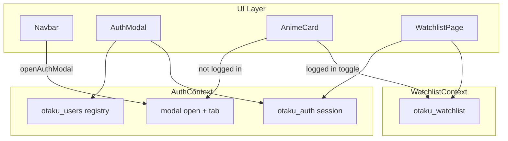

# Auth Modal and Watchlist UI Plan

## Current state

| Area | Today | Gap |
|------|-------|-----|
| Auth | [`contexts/AuthContext.tsx`](contexts/AuthContext.tsx) — email-only `signIn`, no password | Needs registry, password validation, modal controls |
| Sign In UI | Dedicated [`app/sign-in/page.tsx`](app/sign-in/page.tsx) | Replace with modal triggered from Navbar / bookmarks |
| AnimeCard | [`components/AnimeCard.tsx`](components/AnimeCard.tsx) — score badge top-right, no bookmark | Needs floating ribbon + auth gate |
| Watchlist page | [`app/watchlist/page.tsx`](app/watchlist/page.tsx) — open to all, bottom remove button | Needs login gate + overlay remove |

## Architecture



## Step 1 — Validation helpers

Create [`lib/validation.ts`](lib/validation.ts):

- `validateEmail(email)` — non-empty, basic RFC-style pattern
- `validatePassword(password)` — min 6 characters
- `validateSignUp({ email, password, confirmPassword, name? })` — returns field-level error map
- `validateSignIn({ email, password })` — returns field-level error map

Used by the modal forms only; no external deps.

## Step 2 — Extend AuthContext

Update [`contexts/AuthContext.tsx`](contexts/AuthContext.tsx):

**localStorage keys**
- `otaku_auth` — active session (existing)
- `otaku_users` — array of `{ id, email, name, passwordHash }` (store plain password for mock only; document as dev-only)

**New API surface**

```typescript
interface AuthContextValue {
  user: User | null;
  isLoading: boolean;
  isAuthModalOpen: boolean;
  authModalTab: "signin" | "signup";
  openAuthModal: (tab?: "signin" | "signup") => void;
  closeAuthModal: () => void;
  signIn: (email: string, password: string) => { success: boolean; error?: string };
  signUp: (email: string, password: string, name?: string) => { success: boolean; error?: string };
  signOut: () => void;
}
```

**Mock behavior (per your choice)**
- **Sign Up:** validate fields → reject duplicate email → append to `otaku_users` → auto sign-in session
- **Sign In:** validate fields → find user by email → reject if missing or password mismatch → set session
- Passwords stored in plain text in `otaku_users` (acceptable for mock; no real security)

## Step 3 — Auth modal component

Create [`components/AuthModal.tsx`](components/AuthModal.tsx) (client):

**Accessibility**
- `role="dialog"`, `aria-modal="true"`, `aria-labelledby` for title
- Focus trap within modal while open
- Close on Escape, backdrop click, and close button
- Return focus to trigger element on close (via ref passed from Navbar or `document.activeElement` snapshot)
- Visible labels + `aria-invalid` / `aria-describedby` on fields with errors

**UI**
- Full-screen semi-transparent backdrop (`bg-black/70 backdrop-blur-sm`)
- Centered card matching Otaku theme (`bg-otaku-grey`, violet accents)
- Tab switcher: **Sign In** | **Sign Up** (controlled by `authModalTab`)
- **Sign In form:** email, password, submit → `signIn()` → close modal on success
- **Sign Up form:** name (optional), email, password, confirm password → `signUp()` → close modal on success
- Inline field errors below inputs; general error banner for auth failures (e.g. wrong password)
- Loading/disabled state on submit button

Mount globally in [`components/Providers.tsx`](components/Providers.tsx) inside `AuthProvider`:

```tsx
<AuthProvider>
  <WatchlistProvider>
    {children}
    <AuthModal />
  </WatchlistProvider>
</AuthProvider>
```

## Step 4 — Wire Navbar to modal

Update [`components/Navbar.tsx`](components/Navbar.tsx):

- Replace `<Link href="/sign-in">` with `<button onClick={() => openAuthModal("signin")}>`
- Keep avatar + Sign Out unchanged

## Step 5 — Bookmark ribbon on AnimeCard

Convert [`components/AnimeCard.tsx`](components/AnimeCard.tsx) to a **client component** (`"use client"`).

Add [`components/BookmarkRibbon.tsx`](components/BookmarkRibbon.tsx) (or inline) on the poster:

- Position: `absolute top-0 right-0 z-10` ribbon style (violet triangle/fold with `Bookmark` / `BookmarkCheck` icon)
- `e.stopPropagation()` + `e.preventDefault()` on click so it does not navigate the card link
- **Logged in:** toggle `addToWatchlist` / `removeFromWatchlist` via `useWatchlist()`
- **Logged out:** call `openAuthModal("signin")`
- Filled/highlighted state when `isInWatchlist(malId)`
- `aria-label`: "Add to watchlist" / "Remove from watchlist"
- Move score badge to **top-left** (`left-2 top-2`) to avoid overlap with ribbon

## Step 6 — Watchlist page auth gate + overlay remove

Update [`app/watchlist/page.tsx`](app/watchlist/page.tsx):

**Logged out (`!user && !isLoading`)**
- Centered empty state: lock/bookmark icon, "Sign in to view your watchlist"
- Primary CTA button → `openAuthModal("signin")`
- Do not render watchlist grid

**Logged in**
- Keep responsive grid via `AnimeGrid`
- Pass `showRemoveOverlay` (new prop) instead of bottom remove button

Update [`components/AnimeCard.tsx`](components/AnimeCard.tsx) for watchlist mode:

- When `showRemoveOverlay`: absolute overlay button on poster (e.g. bottom-center or top-left on hover)
- Label: "Remove" with `X` or trash icon, `aria-label="Remove from watchlist"`
- Calls `onRemove(malId)` — remove bottom full-width button in favor of overlay per spec

Update [`components/AnimeGrid.tsx`](components/AnimeGrid.tsx) to pass through `showRemoveOverlay`.

## Step 7 — Detail page consistency (small)

Update [`components/WatchlistButton.tsx`](components/WatchlistButton.tsx):

- If not logged in, clicking opens auth modal instead of silently adding
- Keeps detail page behavior aligned with card ribbons

## Step 8 — Retire standalone sign-in page

Update [`app/sign-in/page.tsx`](app/sign-in/page.tsx):

- Redirect to `/` and open modal via `openAuthModal("signin")` on mount
- Prevents broken links from old Navbar URLs / bookmarks

## Files changed summary

| File | Action |
|------|--------|
| [`lib/validation.ts`](lib/validation.ts) | Create |
| [`contexts/AuthContext.tsx`](contexts/AuthContext.tsx) | Extend registry + modal state |
| [`components/AuthModal.tsx`](components/AuthModal.tsx) | Create |
| [`components/Providers.tsx`](components/Providers.tsx) | Mount AuthModal |
| [`components/Navbar.tsx`](components/Navbar.tsx) | Open modal instead of link |
| [`components/AnimeCard.tsx`](components/AnimeCard.tsx) | Client + ribbon + overlay remove |
| [`components/AnimeGrid.tsx`](components/AnimeGrid.tsx) | Pass overlay prop |
| [`components/WatchlistButton.tsx`](components/WatchlistButton.tsx) | Auth gate |
| [`app/watchlist/page.tsx`](app/watchlist/page.tsx) | Login gate + logged-in grid |
| [`app/sign-in/page.tsx`](app/sign-in/page.tsx) | Redirect + open modal |

## Verification checklist

1. Sign Up with valid email/password creates account and logs in; duplicate email shows error
2. Sign In with wrong password shows error; correct credentials log in
3. Modal: tab switch, Escape/backdrop close, keyboard focus stays trapped
4. Bookmark ribbon on home grid toggles watchlist when logged in; opens modal when logged out
5. `/watchlist` logged out shows sign-in prompt; logged in shows grid with overlay Remove buttons
6. Navbar Sign In opens modal; session persists after refresh
