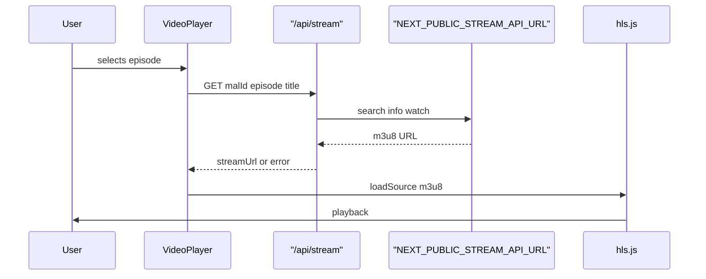

# Real HLS Video Playback

## Current state

- [`components/VideoPlayer.tsx`](components/VideoPlayer.tsx) — empty `<video>` with static "Placeholder player" overlay
- [`components/WatchPageClient.tsx`](components/WatchPageClient.tsx) — passes `currentEpisode` from URL `?ep=N`
- No `.env` files; no streaming library installed
- Jikan metadata (`title`, `malId`, `episodes`) already available on the watch page

## Architecture



**Why API proxy:** avoids browser CORS blocks against third-party stream APIs while keeping the upstream base URL in env for easy swapping.

## Step 1 — Environment configuration

Create [`.env.local.example`](.env.local.example) (committed) and document that users copy to `.env.local`:

```env
# Consumet-compatible API base (self-hosted instance recommended)
NEXT_PUBLIC_STREAM_API_URL=https://your-stream-api.example.com

# Provider path segment (swap if provider changes)
NEXT_PUBLIC_STREAM_PROVIDER=anime/zoro

# Optional: stream resolution timeout in ms (default 15000)
STREAM_FETCH_TIMEOUT_MS=15000
```

Add [`.env.local`](.env.local) to [`.gitignore`](.gitignore) if not already ignored (already covered by `.env*.local`).

Update [`next.config.ts`](next.config.ts) only if needed for external image domains — no change expected for m3u8 URLs loaded by hls.js.

## Step 2 — Streaming resolver library

Create [`lib/stream.ts`](lib/stream.ts) — **server-side only** (imported by API route):

Consumet-compatible resolution chain using `NEXT_PUBLIC_STREAM_API_URL` + `NEXT_PUBLIC_STREAM_PROVIDER`:

| Step | Request | Purpose |
|------|---------|---------|
| 1 | `GET {base}/{provider}/{encodeURIComponent(title)}` | Search by Jikan anime title |
| 2 | `GET {base}/{provider}/info?id={providerId}` | Episode list with provider episode IDs |
| 3 | `GET {base}/{provider}/watch/{episodeId}` | Extract first `sources[]` entry where `isM3U8 === true` |

**Helpers:**
- `getStreamApiConfig()` — reads env, throws descriptive error if base URL missing
- `resolveStreamUrl(title: string, episodeNumber: number): Promise<{ url: string } | { error: string }>` — full chain with `AbortController` timeout (`STREAM_FETCH_TIMEOUT_MS` or 15s)
- Pick best search result (exact title match, else first result)
- Match episode by `number` field, fallback to array index `episodeNumber - 1`
- Handle empty `sources`, non-OK HTTP, JSON parse errors, timeouts → structured error strings

Export types in [`lib/types.ts`](lib/types.ts):

```typescript
export interface StreamResponse {
  url?: string;
  error?: string;
}
```

## Step 3 — API route

Create [`app/api/stream/route.ts`](app/api/stream/route.ts):

```
GET /api/stream?malId=123&episode=1&title=Naruto
```

- Validate query params (`title` required, `episode` positive int)
- Call `resolveStreamUrl(title, episode)`
- Return `200` with `{ url }` or `404`/`502` with `{ error }` (client uses for overlay message)
- `export const dynamic = "force-dynamic"` — no caching of ephemeral stream URLs

## Step 4 — Install hls.js

```bash
npm install hls.js
```

No `@types` package needed — hls.js ships TypeScript types.

## Step 5 — Rewrite VideoPlayer

Refactor [`components/VideoPlayer.tsx`](components/VideoPlayer.tsx):

**On `currentEpisode` / `anime.malId` change:**
1. Reset player state → `loading`
2. `fetch(/api/stream?malId=&episode=&title=)` with client-side timeout (AbortController, 16s)
3. On success → attach stream; on failure → `error` state with message

**hls.js integration:**
- If `Hls.isSupported()` → create `Hls` instance, `loadSource(url)`, `attachMedia(videoRef)`
- Else if Safari native HLS → set `video.src = url`
- Cleanup: destroy Hls instance on episode change/unmount
- Remove static placeholder overlay when stream loads successfully

**UI states:**

| State | Display |
|-------|---------|
| `loading` | Spinner overlay on player area |
| `ready` | Video controls visible, no overlay |
| `error` | Semi-transparent overlay: error message + **Retry** button |

**Auth (unchanged):** `onPlay` still gates watch history — logged-out users get auth modal + pause; logged-in users call `markEpisodeWatched`.

**hls.js errors:** listen to `Hls.Events.ERROR` → fatal errors trigger same error overlay.

## Step 6 — Minor WatchPageClient tweak

[`components/WatchPageClient.tsx`](components/WatchPageClient.tsx) — pass `anime.title` is already inside `anime` prop on `VideoPlayer`; no structural change required. Ensure `VideoPlayer` `key` includes `currentEpisode` so player remounts cleanly (already present).

## Files summary

| File | Action |
|------|--------|
| [`.env.local.example`](.env.local.example) | Create with stream env vars |
| [`lib/types.ts`](lib/types.ts) | Add `StreamResponse` |
| [`lib/stream.ts`](lib/stream.ts) | Create Consumet-compatible resolver |
| [`app/api/stream/route.ts`](app/api/stream/route.ts) | Create proxy endpoint |
| [`components/VideoPlayer.tsx`](components/VideoPlayer.tsx) | hls.js player + fetch + error overlay |
| [`package.json`](package.json) | Add `hls.js` dependency |

## Setup note for developer

The official Consumet public API is no longer hosted — you must point `NEXT_PUBLIC_STREAM_API_URL` at a [self-hosted Consumet instance](https://github.com/consumet/consumet.ts) or any API that follows the same route shape. Swap `NEXT_PUBLIC_STREAM_PROVIDER` when changing providers (e.g. `anime/gogoanime`).

## Verification checklist

1. With valid `.env.local`, selecting an episode fetches stream URL via `/api/stream`
2. hls.js plays `.m3u8` in Chrome/Edge; Safari uses native HLS fallback
3. Invalid/missing API URL or 404 upstream shows error overlay with Retry
4. Changing episodes destroys old Hls instance and loads new stream
5. Logged-in play still marks episode watched; logged-out play opens auth modal
6. `npm run build` passes
