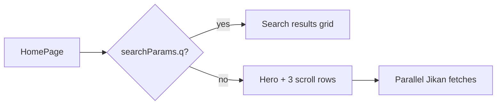

# Homepage Hero and Jikan Content Rows

## Current state

- [`app/page.tsx`](app/page.tsx) — single flat grid via `getTopAnime()` or `searchAnime(q)`; no hero or rows
- [`lib/jikan.ts`](lib/jikan.ts) — only `getTopAnime`, `searchAnime`, `getAnimeById`
- [`components/AnimeCard.tsx`](components/AnimeCard.tsx) + [`components/BookmarkRibbon.tsx`](components/BookmarkRibbon.tsx) — already sync with `WatchlistContext` and auth gate
- [`components/WatchlistButton.tsx`](components/WatchlistButton.tsx) — reusable toggle with "In Watchlist" state
- **No** [`app/watch/[id]/page.tsx`](app/watch/[id]/page.tsx) — "Watch Now" has nowhere to link yet

## Page modes



- **Browse mode** (default `/`): hero + rows
- **Search mode** (`/?q=...`): keep existing results grid (no hero) so navbar search still works

## Step 1 — Extend Jikan API layer

Update [`lib/jikan.ts`](lib/jikan.ts) with row-specific fetchers (limit 12 each, `revalidate: 3600`):

| Function | Jikan endpoint | Row label |
|----------|----------------|-----------|
| `getTrendingAnime()` | `/top/anime?filter=airing&limit=12` | Trending Now |
| `getPopularAnime()` | `/top/anime?filter=bypopularity&limit=12` | Popular |
| `getTopRatedAnime()` | `/top/anime?filter=favorite&limit=12` | Top Rated |
| `getHeroAnime()` | First item from airing top, enriched via `/anime/{id}/full` for synopsis | Hero |

Refactor shared list fetch into a private helper:

```typescript
async function fetchAnimeList(path: string): Promise<AnimeItem[]>
```

`getHeroAnime()` returns the top airing anime with full synopsis; falls back to list-only data if full fetch fails.

No changes needed to [`lib/types.ts`](lib/types.ts) — existing `AnimeItem` fields are sufficient.

## Step 2 — Stream player route (Watch Now target)

Create [`app/watch/[id]/page.tsx`](app/watch/[id]/page.tsx):

- Server component: validate `id`, fetch anime via `getAnimeById`
- Minimal player shell: title, episode placeholder, back link
- Otaku-themed layout with a centered 16:9 video placeholder (`bg-otaku-grey`) and copy: "Player coming soon"
- Enables functional **Watch Now** links at `/watch/{malId}`

Optionally update [`app/anime/[id]/page.tsx`](app/anime/[id]/page.tsx) disabled Watch Now button to link to the same route for consistency.

## Step 3 — Hero banner component

Create [`components/HeroBanner.tsx`](components/HeroBanner.tsx) (client component):

**Layout**
- Full-width section (~420–520px tall on desktop, shorter on mobile)
- Background: hero anime `imageUrl` with `object-cover`, dark gradient overlay (`from-otaku-black via-otaku-black/80 to-transparent`)
- Content: title (large), score/episodes badges, truncated synopsis (3 lines), CTA row

**Buttons**
- **Watch Now** — `<Link href={/watch/${anime.malId}}>` with `Play` icon, primary violet styling
- **Add to Watchlist** — reuse [`WatchlistButton`](components/WatchlistButton.tsx) (already toggles to checkmark + "In Watchlist")

Props: `anime: AnimeItem` passed from server page.

## Step 4 — Horizontal content row component

Create [`components/AnimeRow.tsx`](components/AnimeRow.tsx):

- Section heading (e.g. "Trending Now") + optional "See all" link to `/?q=` or detail browse (optional, can omit for v1)
- Horizontally scrollable container:
  - `flex gap-4 overflow-x-auto pb-4 snap-x snap-mandatory`
  - Hide scrollbar via existing globals or `scrollbar-hide` utility
  - Each card: fixed width (`w-36 sm:w-44`) wrapping existing [`AnimeCard`](components/AnimeCard.tsx)
- **Bookmark ribbons** on cards already reflect global watchlist — no extra wiring needed

Props:

```typescript
interface AnimeRowProps {
  title: string;
  anime: AnimeItem[];
}
```

## Step 5 — Refactor homepage

Update [`app/page.tsx`](app/page.tsx):

**Search branch** (`q` present):
- Unchanged UX: title + `AnimeGrid`

**Browse branch** (no `q`):
- Parallel fetch with `Promise.all`:

```typescript
const [hero, trending, popular, topRated] = await Promise.all([
  getHeroAnime(),
  getTrendingAnime(),
  getPopularAnime(),
  getTopRatedAnime(),
]);
```

- Render structure:

```tsx
<>
  {hero && <HeroBanner anime={hero} />}
  <div className="mx-auto max-w-7xl space-y-10 px-4 py-8 sm:px-6 lg:px-8">
    <AnimeRow title="Trending Now" anime={trending} />
    <AnimeRow title="Popular" anime={popular} />
    <AnimeRow title="Top Rated" anime={topRated} />
  </div>
</>
```

- Skip hero if `getHeroAnime()` returns null (graceful empty state)

## Step 6 — Polish

- Add horizontal-scroll CSS to [`app/globals.css`](app/globals.css) if needed (thin scrollbar or hidden)
- Hero uses `priority` on background `Image` for LCP
- Dedupe hero anime from first row if same `malId` appears in Trending row (filter it out client-side or in page before passing to `AnimeRow`)

## Files summary

| File | Action |
|------|--------|
| [`lib/jikan.ts`](lib/jikan.ts) | Add row fetchers + `getHeroAnime` |
| [`components/HeroBanner.tsx`](components/HeroBanner.tsx) | Create |
| [`components/AnimeRow.tsx`](components/AnimeRow.tsx) | Create |
| [`app/page.tsx`](app/page.tsx) | Hero + rows browse layout; keep search mode |
| [`app/watch/[id]/page.tsx`](app/watch/[id]/page.tsx) | Create player placeholder |
| [`app/anime/[id]/page.tsx`](app/anime/[id]/page.tsx) | Link Watch Now to `/watch/[id]` (small) |
| [`app/globals.css`](app/globals.css) | Optional scroll-row utilities |

## Verification checklist

1. `/` loads hero with top airing anime from Jikan
2. Watch Now navigates to `/watch/{id}`
3. Hero watchlist button toggles and persists; navbar badge updates
4. Three rows scroll horizontally; card bookmark ribbons reflect watchlist state
5. `/?q=naruto` still shows search grid without hero
6. Build passes with no new lint/type errors
