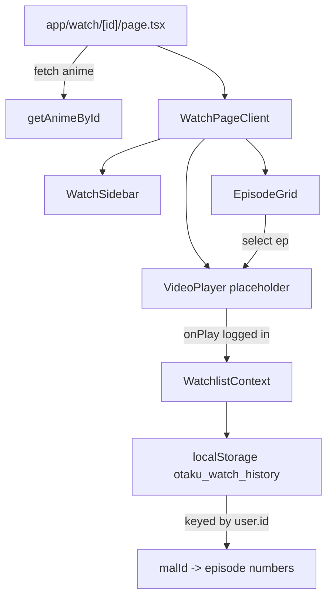

# Dynamic Watch Page and Watched History

## Current state

- [`app/watch/[id]/page.tsx`](app/watch/[id]/page.tsx) — static placeholder, no player controls or episodes
- [`contexts/WatchlistContext.tsx`](contexts/WatchlistContext.tsx) — watchlist bookmarks only (`otaku_watchlist`)
- [`contexts/AuthContext.tsx`](contexts/AuthContext.tsx) — provides `user.id` for profile scoping
- [`lib/jikan.ts`](lib/jikan.ts) — `getAnimeById` returns `AnimeItem` with `episodes`, `synopsis`, `score`

## Architecture



## Step 1 — Types and storage shape

Update [`lib/types.ts`](lib/types.ts):

```typescript
export interface WatchHistory {
  [malId: number]: number[]; // watched episode numbers
}

export interface UserWatchHistoryStore {
  [userId: string]: WatchHistory;
}
```

Storage key: `otaku_watch_history` — entire store is one JSON object keyed by `user.id`.

**Login required** (per your choice): history reads/writes only when `user` is non-null. Logged-out users can browse the page and select episodes, but playing opens the auth modal and does not persist progress.

## Step 2 — Extend WatchlistContext

Update [`contexts/WatchlistContext.tsx`](contexts/WatchlistContext.tsx):

- Import `useAuth()` inside `WatchlistProvider` (already nested under `AuthProvider` in [`components/Providers.tsx`](components/Providers.tsx))
- Add state: `watchHistory: WatchHistory` (current user's slice only)
- Hydrate on mount and when `user.id` changes — load `store[user.id] ?? {}`
- Clear in-memory history when user signs out

**New API:**

| Method | Behavior |
|--------|----------|
| `markEpisodeWatched(malId, episode)` | Append episode if not present; persist to `otaku_watch_history[user.id]` |
| `isEpisodeWatched(malId, episode)` | Boolean check |
| `getWatchedEpisodes(malId)` | Returns `number[]` |

Keep existing watchlist methods unchanged.

## Step 3 — Client watch layout

Split server page from interactive UI:

**[`app/watch/[id]/page.tsx`](app/watch/[id]/page.tsx)** (server)
- Validate `id`, fetch anime via `getAnimeById`
- Read optional `searchParams.ep` for initial episode (default `1`)
- Pass `anime` + `initialEpisode` to client component

**Create [`components/WatchPageClient.tsx`](components/WatchPageClient.tsx)** (client)
- Responsive grid: player column + sidebar on desktop; stacked on mobile
- State: `currentEpisode` (synced to URL via `router.replace` with `?ep=N` on change)
- Compute episode count: `anime.episodes && anime.episodes > 0 ? anime.episodes : 1` (fallback for ongoing/unknown)

### Video player — [`components/VideoPlayer.tsx`](components/VideoPlayer.tsx)

- HTML5 `<video controls poster={anime.imageUrl} className="w-full aspect-video">` with no `src` (placeholder)
- Overlay label: "Placeholder player — real streams coming soon"
- `onPlay` handler:
  - If `!user` → `openAuthModal("signin")` + `pause()` video
  - If logged in → `markEpisodeWatched(anime.malId, currentEpisode)`
- Display "Episode {n}" heading above player

### Sidebar — [`components/WatchSidebar.tsx`](components/WatchSidebar.tsx)

- Poster thumbnail, title, MAL score, episode count, truncated synopsis
- Link back to [`/anime/[id]`](app/anime/[id]/page.tsx)
- Reuse [`WatchlistButton`](components/WatchlistButton.tsx) for quick bookmark toggle

### Episode grid — [`components/EpisodeGrid.tsx`](components/EpisodeGrid.tsx)

- Responsive grid of episode buttons (`grid-cols-4 sm:grid-cols-6 md:grid-cols-8`)
- **Active** episode: violet border/background highlight
- **Watched** episode: dimmed text + `Check` icon (from Lucide), via `isEpisodeWatched`
- Click → set `currentEpisode`, update URL, scroll player into view on mobile

## Step 4 — Page layout (visual structure)

```
┌─────────────────────────────────────────────────────┐
│ Back link + title                                   │
├──────────────────────────────┬──────────────────────┤
│  HTML5 video (placeholder)   │  Sidebar: poster,    │
│  Episode N label             │  meta, synopsis,     │
├──────────────────────────────┤  watchlist btn       │
│  Episode grid (1 … N)        │                      │
└──────────────────────────────┴──────────────────────┘
```

Desktop: `lg:grid-cols-[1fr_320px]`. Mobile: player → grid → sidebar.

## Step 5 — Auth gate on play

When a logged-out user clicks **Play** on the video or selects an episode and hits play:
- Call `openAuthModal("signin")` from `useAuth()`
- Do not write to history until authenticated

Episode **selection** (without pressing play) remains available to everyone so they can browse the grid.

## Files summary

| File | Action |
|------|--------|
| [`lib/types.ts`](lib/types.ts) | Add `WatchHistory`, `UserWatchHistoryStore` |
| [`contexts/WatchlistContext.tsx`](contexts/WatchlistContext.tsx) | Add user-scoped watch history |
| [`components/VideoPlayer.tsx`](components/VideoPlayer.tsx) | Create HTML5 placeholder + onPlay |
| [`components/WatchSidebar.tsx`](components/WatchSidebar.tsx) | Create Jikan detail sidebar |
| [`components/EpisodeGrid.tsx`](components/EpisodeGrid.tsx) | Create episode buttons with watched state |
| [`components/WatchPageClient.tsx`](components/WatchPageClient.tsx) | Orchestrate layout + episode state |
| [`app/watch/[id]/page.tsx`](app/watch/[id]/page.tsx) | Server fetch + delegate to client |

## Verification checklist

1. `/watch/{id}` shows player, sidebar with Jikan details, and episode grid
2. Selecting an episode updates URL `?ep=N` and highlights the active button
3. Logged-in user presses play → episode marked watched (checkmark + dimmed) and persists after refresh
4. Signed-out user pressing play → auth modal opens, no history saved
5. Different users on same browser have separate history buckets keyed by `user.id`
6. Build and types pass
